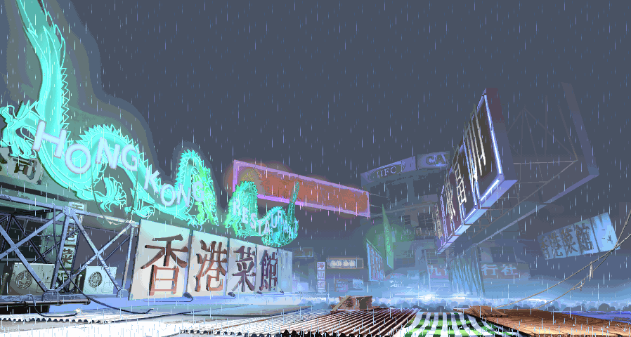

***"Habit is the second nature"***

### About me:
- cybersec student 
- golden era: 2004
- network security
- pt-br(native)
- en-us(intermediate) -> im working to improve btw
- programming languages:
  - Python (i know something)
  - C (i know something)
  - JavaScript (i know something)
  - Assembly x86-64 (learning the basics)

