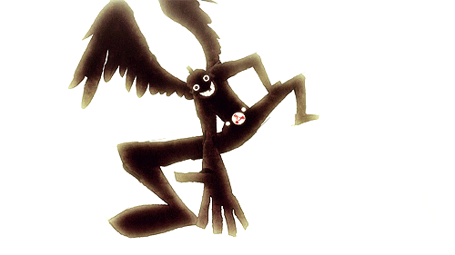

***"Habit is the second nature"***

### About me:
- cybersec and software development student 
- golden era: 2004
- reverse engineering
- low level stuff

### programming languages:
- Python (i know some stuff)
- C (i know some stuff)
- Asssembly (learning the fundamentals)
- JavaScript (i know some stuff)
- PHP ( learning the fundamentals)

### other languages:
- pt-br(native)
- en-us(intermediate) -> im working to improve btw

