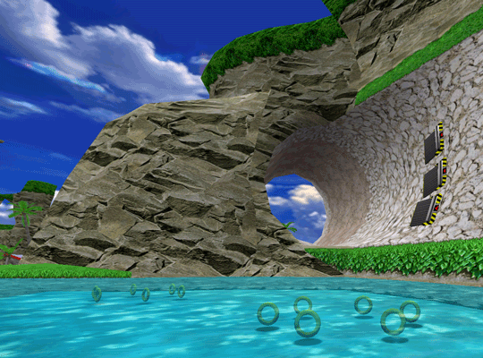

***"Habit is the second nature"***

### About me:
- cybersec student 
- golden era: 2004
- security is my passion (lol)
- game hacking/reversing
- pentesting
- i want to understand how computers work

### programming languages:
- Python (i know some stuff)
- C (i know some stuff)
- Go (learning the fundamentals)
- JavaScript (know some stuff/learning)

### other languages:
- pt-br(native)
- en-us(intermediate) -> im working to improve btw

